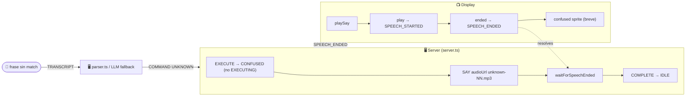

# UNKNOWN

Fallback cuando nada matchea. Cara confundida + mensaje genérico.

## TL;DR

Único comando cuyo EXECUTE lleva a `CONFUSED` (no `EXECUTING` ni `CELEBRATING`). Es la única ruta al estado `CONFUSED` además de un `ERROR` explícito.

## Flowchart



**Leyenda**: 🟦 server · 🟩 display. Único comando cuyo EXECUTE lleva directo a `CONFUSED` (no `EXECUTING`). El path del parser local tiene su propio pre-check de LLM fallback (`/api/interpret`) antes de broadcastear `UNKNOWN` definitivo.

## Forma

```ts
{ type: "UNKNOWN"; raw?: string }
```

`raw` es el texto ORIGINAL de la transcripción (antes de normalizar), para debug en `/control`.

## Disparador

### Parser local (`src/lib/robi/parser.ts:113-156`)

Retorna `UNKNOWN` cuando:

1. El texto normalizado queda vacío (línea 118).
2. Ningún pattern del `PATTERNS` matchea (línea 155, fallback al final del loop).
3. El texto tiene `gira`/`voltea` con dirección lateral (línea 131, turn commands eliminados).

### LLM fallback

`src/lib/llm/system-prompt.ts` puede devolver `UNKNOWN` si la transcripción es ambigua (no matchea ninguno de los 13 commands tipados).

### Validación

Sin schema específico — UNKNOWN siempre pasa.

## Audio

- **Categoría**: `UNKNOWN`.
- **Archivos**: `public/audio/unknown-{01,02}.mp3` (2 entries).
- **Texto de muestra**: "No entendí esa instrucción. ¿Probamos otra?" / "Todavía no aprendí a hacer eso."

## State machine

| T | Event | Reducer | Sprite |
|---|---|---|---|
| 0 | `EXECUTE {command: UNKNOWN}` | **`CONFUSED`** (NO EXECUTING) | `confused` |
| audio_end | `THINK` (content) | THINKING | `confused` (sigue brevemente) |
| post-delay | `COMPLETE` | `IDLE` | `idle` |

`actionAnimationMs(UNKNOWN) = 0` (content command).

## Posición y dirección

No cambia. `pendingMove = null`.

## Flujo del servidor

Branch genérico (línea ~246). La diferencia está en el reducer (`CONFUSED` en lugar de `EXECUTING`).

## Sprite track (`src/components/display/sprites.ts:88`)

```ts
confused: { id: "confused", row: 2, startCol: 8, frameCount: 2, duration: 0.6 }
```

2 frames, loop 0.6s. Sprite de "no entender".

## Edge cases

- **UNKNOWN spam**: el LLM fallback puede ser lento si el operador manda muchas frases UNKNOWN. El state `processing` lockea — los siguientes se rechazan como `STOP`.
- **UNKNOWN con `raw` largo**: el audio dirá "no entendí" pero el operador verá la transcripción original en `lastCommand.raw` (control UI).
- **UNKNOWN durante EXECUTING previo**: el comando actual termina normal; UNKNOWN se queuea.

## Diagnóstico de "ruido"

| Síntoma | Dónde mirar |
|---|---|
| Frases válidas matchean UNKNOWN | Revisar orden de `PATTERNS` en parser: patrones más específicos primero. |
| Estado `CONFUSED` no aparece | `src/lib/robi/reducer.ts:124-127` — case `UNKNOWN` debe llevar a `CONFUSED`. |
| Ámbigüedades caen en UNKNOWN en lugar de LLM | `src/lib/robi/config.server.ts` — `llmFallbackEnabled: true/false`. Si `false`, UNKNOWN es el final del path. |
| Display muestra sprite equivocado | `src/components/display/sprites.ts:spriteTrackFor()` case `UNKNOWN` → `confused`. |

## Puntos de tweak

| Querés cambiar... | Archivo:línea |
|---|---|
| Habilitar LLM fallback | `src/lib/robi/config.server.ts:llmFallbackEnabled = true` |
| Regex de UNKNOWN (turn detection) | `src/lib/robi/parser.ts:131-137` |
| Audio | `sonidos/audios.json` + `pnpm audios` |
| Estado al que va | `src/lib/robi/reducer.ts:124-127` |

## Dependencias

- `src/types/robi.ts:29`
- `src/lib/robi/parser.ts:113-156`
- `src/lib/robi/reducer.ts:124-127` (CONFUSED)
- `src/lib/robi/responses.ts:65` (categoryFor)
- `src/components/display/sprites.ts:88, 207-208`
- `sonidos/audios/unknown-{01,02}.mp3`

## Tests

- `src/lib/robi/parser.test.ts`:
  - "fall through to UNKNOWN when no pattern matches"
  - "turn verbs + lateral direction → UNKNOWN"
- `src/lib/robi/reducer.test.ts`:
  - "UNKNOWN sets state CONFUSED"
- `src/lib/realtime/server.test.ts`:
  - "UNKNOWN command moves state to CONFUSED"
